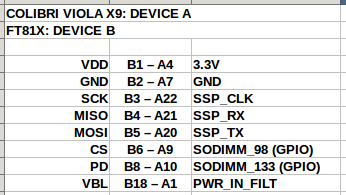

# Eve Screen Designer Colibri Hal Implementation
### Devices

- NHD_3_5C_FT813
- Colibri iMX6 
- Viola carrier board V1.2

### Preparing

- Connect pins
  
  

- If needed, configure defines such as pd, cs pins in `Colibri_Hal/colibri/pinCtl.h` and spi clock speed, spi path in `Colibri_Hal/colibri/colibri_spi.h`

### Usage

- As an example `EVE Screen Designer/Examples/Basic/RadioButtonGroups` used in this project.
- Copy `RadioButtonGroups/Generated` to Project folder. It should be in same directory with README.me
- Run `script.sh`, `./script.sh`
- If working on linux machine, fix lower/upper case issues.